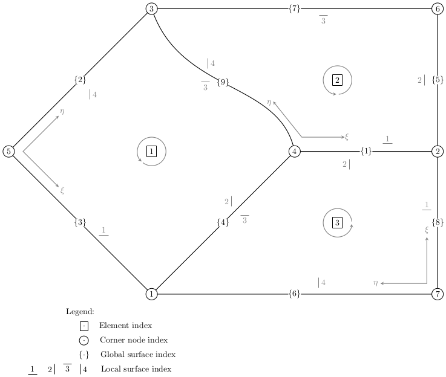

# Unstructured quadrilateral mesh

Herein we describe the conventions taken in the implementation for two-dimensional unstructured quadrilateral meshes. Principally, this relates to how a file with the extension `.mesh` encodes information about the numbering and orientation of elements in an unstructured quadrilateral mesh with possibly curved boundaries.

We use the following unstructured mesh with three elements for this discussion:



Further, we provide a complete mesh file below in the format that could be read into Trixi.


## Mesh file header

The first line of the mesh file lists the total number of *corners*, *surfaces*, *elements*, and the *polynomial order* that the mesh will use to represent any curved sides. For the example mesh these quantities are
```
    7    9    3    8
```
corresponding to seven corners, nine surfaces, and three elements. We note that the mesh polynomial degree of eight is taken simply for illustrative purposes. In practice, this mesh polynomial degree typically depends on the particular application for which the curved, unstructured mesh is required. 


## List of corner nodes

After these global counts that prescribe information about the mesh skeleton the mesh file give a list of the physical `(x,y)` coordinates of all the corners. The corner nodes are listed in the order prescribed by mesh generator. Thus, for the example mesh this node list would be
```
 1.0    -1.0
 3.0    0.0
 1.0    1.0
 2.0    0.0
 0.0    0.0
 3.0    1.0
 3.0    -1.0
```

## List of neighbor connectivity

After the corner list comes the neighbor connectivity along each surface in the mesh. This includes local indexing and orientation information necessary to compute the coupling between elements in the mesh. In 2D each surface is defined by connecting two nodes indexed as with the numbering above. We adopt the convention that node id 1 < node id 2.

Each surface will have two neighbors where the element on the left locally as one "walks" from node id 1 to node id 2 is taken to be the `primary` element and the element locally on the right is taken to be the `secondary` element. If, however, there is no secondary element index, then the surface lies along a physical boundary. In this case the only available element index is considered to be `primary` and the secondary index is set to zero.

The final two index numbers within the neighbor information list are used to identify the local surface within each element. The first local surface index (on the primary element) will always be positive whereas the second local surface index (on the primary element) can be positive or negative. If the second local surface index is positive, then the local coordinate systems in the primary element and secondary element match, i.e., the indexing on either side runs from 1,...,`polydeg` + 1. However, if the local surface index of the secondary element is negative in the mesh file, then the coordinate system in the secondary element is **flipped** with respect to the primary element. Therefore, care must be taken in the implementation to ensure that the primary element indexing runs from 1,...,`polydeg` + 1 whereas the secondary element indexing must run in reverse from `polydeg` + 1, ..., 1. Finally, if the secondary element index is zero, then so will be the local surface index because the surface is on a physical boundary. Also, there is no *flipping* of coordinate indexing required at the physical boundary because there exists on the primary element's coordinate system.

### Three examples: One along a physical boundary and two along interior surfaces.

Along edge `{8}` we connect node `(2)` to node `(7)` and are along a physical boundary in element `3` with the local surface index 1 and the neighbor information:
```
    2    7    3    0    1    0
```

Along edge `{1}` we connect node `(2)` to node `(4)` such that the primary element is `3` with local surface index `2` and the secondary element is `2` with local surface index `1`. Furthermore, we see that coordinate system in the secondary element `2` is **flipped** with respect to the primary element's coordinate system such that the sign of the local surface index in the secondary element flips. This gives the following neighbor information:
```
    2    4    3    2    2    -1
```

Along edge `{4}` we connect node `(1)` to node `(4)` such that the primary element is `1` with local surface index `2` and the secondary element is `3` with local surface index `3`. The coordinate systems in both elements match and no sign change is required on the local surface index in the secondary element:
```
    1    4    1    3    2    3
```

We collect the complete neighbor information for the example mesh above:
```
    2    4    3    2    2    -1
    3    5    1    0    4    0
    1    5    1    0    1    0
    1    4    1    3    2    3
    2    6    2    0    2    0
    1    7    3    0    4    0
    3    6    2    0    3    0
    2    7    3    0    1    0
    3    4    2    1    4    -3
```

## List of elements

Each quadrilateral element in the unstructured mesh is dictated by four corner points with indexing taken from the numbering given by the corner list above. We connect a set of four corner points (starting from the bottom left) in an anti-clockwise fashion thus making the element *right-handed* indicated using the circular arrow in the figure above. In turn, this right-handedness defines the local surface indexing (i.e. the four local sides) and the local \\((\xi, \eta)\\) coordinate system. For example, the four corners for element 1 would be listed as
```
    5    1    4    3
```

The mesh file also encodes information for curved surfaces either interior to the domain (as surface `{9}` above) or along the physical boundaries. A set of check digits are included directly below the four corner indexes to indicate whether the local surface index (`1`, `2`, `3`, or `4`) within the element is straight sided, `0`, or is curved, `1`. If the local surface is straight sided no additional information is necessary during the mesh file read in. But for any curved surfaces the mesh file provides `(x,y)` coordinate values in order to construct an interpolant of this surface with the mesh polynomial order at the Chebyshev-Gauss-Lobatto nodes. This list of `(x,y)` data will be given in the direction of the local coordinate system.

The last piece of information provided by the mesh file are labels for the different surfaces of an element. These labels are useful to set boundary conditions along physical surfaces. The labels can be short descriptive words. The label `---` indicates an internal surface where no boundary condition is required.

As an example, the complete information for element `1` in the example mesh would be
```
    5    1    4    3
    0    0    1    0
 1.000000000000000   1.000000000000000
 1.024948365654583   0.934461926834452
 1.116583018200151   0.777350964621867
 1.295753434047077   0.606254343587194
 1.537500000000000   0.462500000000000
 1.768263070247418   0.329729152118310
 1.920916981799849   0.185149035378133
 1.986035130050921   0.054554577460044
 2.000000000000000                   0
 Slant1 --- --- Slant2
 ```

We collect the complete set of element information for the example mesh
```
    5    1    4    3
    0    0    1    0
 1.000000000000000   1.000000000000000
 1.024948365654583   0.934461926834452
 1.116583018200151   0.777350964621867
 1.295753434047077   0.606254343587194
 1.537500000000000   0.462500000000000
 1.768263070247418   0.329729152118310
 1.920916981799849   0.185149035378133
 1.986035130050921   0.054554577460044
 2.000000000000000                   0
 Slant1 --- --- Slant2
    4    2    6    3
    0    0    0    1
 2.000000000000000                   0
 1.986035130050921   0.054554577460044
 1.920916981799849   0.185149035378133
 1.768263070247418   0.329729152118310
 1.537500000000000   0.462500000000000
 1.295753434047077   0.606254343587194
 1.116583018200151   0.777350964621867
 1.024948365654583   0.934461926834452
 1.000000000000000   1.000000000000000
 --- Right Top ---
    7    2    4    1
    0    0    0    0
 Right --- --- Bottom
```
